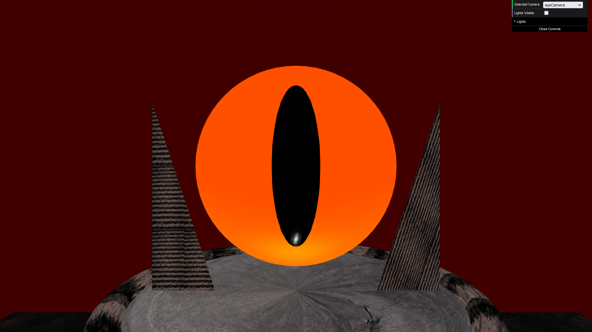
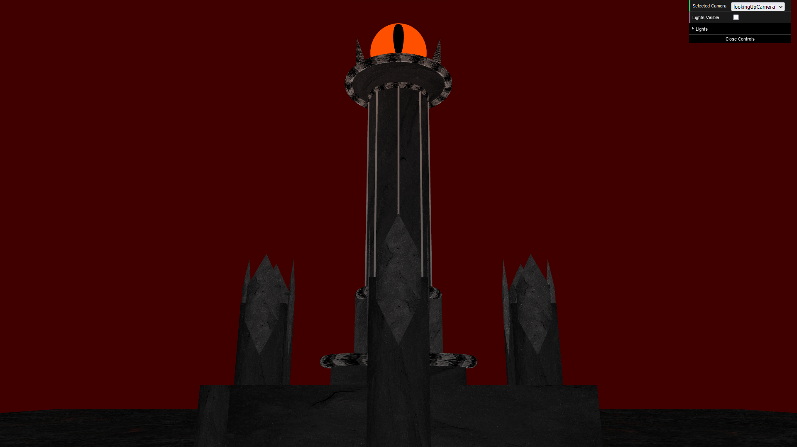
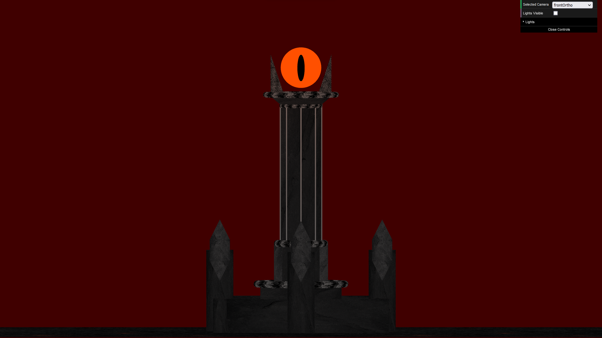

# SGI 2022/2023 - TP1

## Group T0xG0y
| Name             | Number    | E-Mail             |
| ---------------- | --------- | ------------------ |
| André Flores        | 201907001 | up201907001@fe.up.pt  |
| Diogo Faria         | 201907014 | up201907014@fe.up.pt|

----

### Project Information

- Strong points
  - We implemented all of the required functionalities and can interpret scene files from various other groups.
  - Our parser has good error reporting and runs a check for cycles in the scene graph. 
  - Our primitives don't repeat points in the same geometric coordinates unless that is required for proper texture application.
  - We have a checkbox to toogle displaying the lights
- Scene
  - Our scene represents the Eye of Sauron anf the tower beneath it
  - The scene file can be found [here](scenes/barad-dur.xml)

Here are some screenshots of the scene

----
## Issues/Problems

- Texture application on the triangle primitive can have strange looking results as exemplified in the [eye view screenshot](screenshots/eyeView.png)
