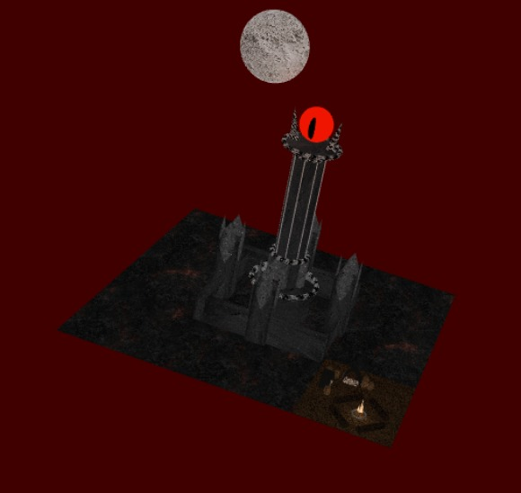
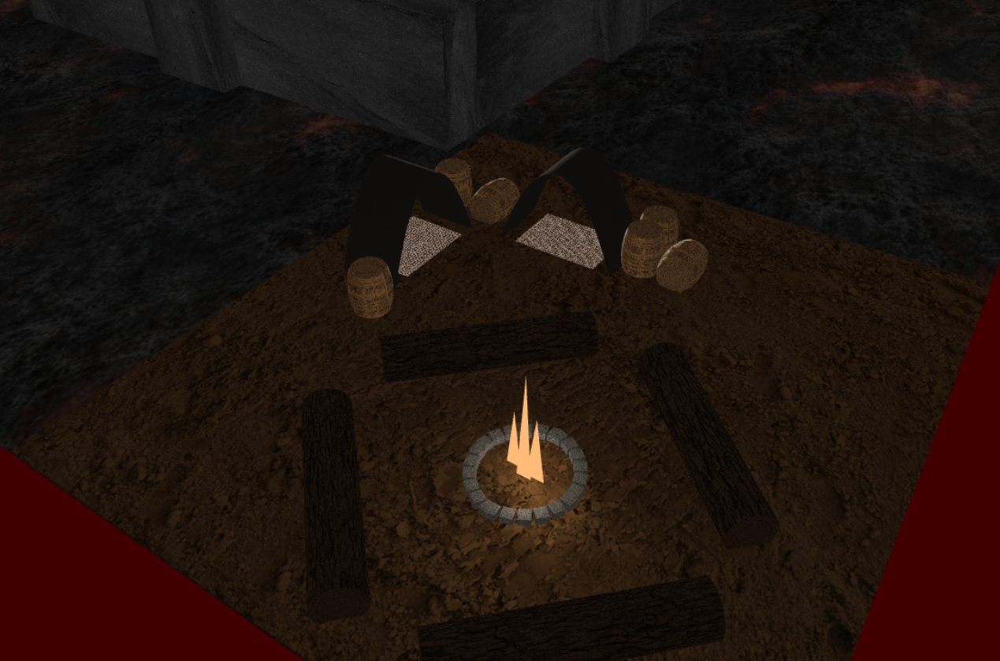

# SGI 2022/2023 - TP2

## Group: T01G06
| Name             | Number    | E-Mail             |
| ---------------- | --------- | ------------------ |
| André Flores        | 201907001 | up201907001@fe.up.pt  |
| Diogo Faria         | 201907014 | up201907014@fe.up.pt|

----

### Project Information

- Strong points
  - We implemented all of the required functionalities
  - Aside from all the required functionalities, we implemented, for each highlighted component, a colour picker and a slider to control the scale
- Scene
  - Our scene represents the Eye of Sauron and the tower beneath it, just like in the previous TP, with the adition of an encampment on the side and a moon in the sky
  - In the moon, an animation with translation and rotation is applied, and in the encampment a rotation animation is applied
  - The eye, its pupil, and the fire in the encampment are all highlighted components
  - The tent, the 'rug' inside, and the barrels are all NURBS.
  - The scene file can be found [here](scenes/barad-dur.xml)

Here are some screenshots of the scene

----
## Issues/Problems

