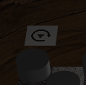

# Rules

The game rules are the ones specified in the [website](https://www.ultraboardgames.com/checkers/game-rules.php) given in Moodle. The timeout for making a move is one minute, if the timeout is reached the player whose turn it is forfeits the game.

# Interface

## Making moves

The player whose turn it is makes a move by first selecting one of their pieces and then selecting the square they want to move to, this is done by clicking the piece or square with the mouse.

## Replay

At any point the game may be replayed from the beginning by clicking the button in the image below (Fig. 1).

## HUD

### Top left corner

In the top left corner of the viewbox the players can see their respective scores (how many pieces they've captured).

### Top right corner

In the top right corner the players can select one of three camera views by clicking **Board**, **Player 1** or **Player 2**.

### Bottom left corner

In the bottom left corner the players can use the following features by clicking the buttons:

- **ENABLE/DISABLE CHANGE CAMERAS** - toggle automatic camera switch according to whose turn it is
- **CHANGE SCENE** - switch through various scenes
- **UNDO** - undoes last move
- **REDO** - redoes last undone move

### Bottom right corner

In the bottom right corner the players may see the time since the game begun and the time since the current move begun

## Keyboard

There are two keyboard funtions:

- **A** - Redo
- **Z** - Undo
